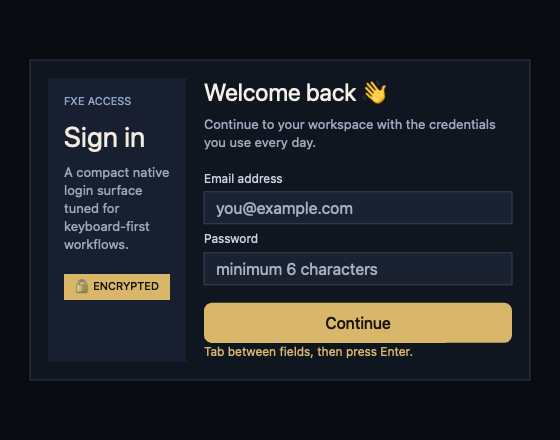

<h1 align="center">FXE</h1>

<p align="center">
  <strong>Desktop apps in TypeScript, on a native GPU renderer.</strong><br/>
  <em>Electron, without Chromium.</em>
</p>

<p align="center">
  <a href="#quick-start">Quick start</a> ·
  <a href="#examples">Examples</a> ·
  <a href="#api-overview">API</a> ·
  <a href="#debugging">Debugging</a> ·
  <a href="#building-from-source">Build</a>
</p>

<p align="center">
  
  
  
  
  
</p>

<p align="center">
  
  <br>
  <sub><i>Frameless, transparent V8 + Dawn window driving the <code>fxe-ui</code> reconciler — see <a href="examples/js/login_form.tsx"><code>examples/js/login_form.tsx</code></a>.</i></sub>
</p>

<table align="center"><td>

```tsx
function LoginForm() {
	const [email, setEmail] = useState("");
	const [password, setPassword] = useState("");
	const [message, setMessage] = useState("");

	const submit = () =>
		setMessage(
			email.includes("@") && password.length >= 6
				? "Credentials look ready."
				: "Use an email and a 6+ character password.",
		);

	return (
		<View style={s.root}>
			<View style={s.shell}>
				<View style={s.rail}>
					<Text style={s.railKicker}>FXE · ACCESS</Text>
					<Text style={s.railWordmark}>Sign in</Text>
					<Text style={s.railBody}>A compact native login surface…</Text>
					<View style={s.railBadge}>
						<Text style={s.railBadgeText}>🔒 ENCRYPTED</Text>
					</View>
				</View>
				<View style={s.panel}>
					<Text style={s.eyebrow}>ACCOUNT · SIGN IN</Text>
					<Text style={s.title}>Welcome back 👋</Text>
					<Text style={s.copy}>Pick up where you left off…</Text>
					<View style={s.form}>
						<Text style={s.label}>Email address</Text>
						<TextInput
							style={s.input}
							value={email}
							placeholder="you@example.com"
							onChange={setEmail}
							onSubmit={submit}
						/>
						<Text style={s.label}>Password</Text>
						<TextInput
							style={s.input}
							value={password}
							/* … */
						/>
						<Button title="Continue" style={s.button} textStyle={s.buttonText} onPress={submit} />
					</View>
					<Text style={s.foot}>{message || "Tab between fields, then press Enter."}</Text>
				</View>
			</View>
		</View>
	);
}

const win = new Window({
	width: 620,
	height: 480,
	title: "fxe-ui login form",
	transparent: true,
	decorated: false,
});
mount(<LoginForm />, win, { lazy: false });
App.run({ animate: true, fps: 60 });
```

</td></table>

---

FXE runs your `.ts`/`.tsx` script inside an embedded V8 isolate and paints
directly to the GPU via Dawn/WebGPU — no DOM, no browser, no IPC bridge. UI is
authored in JSX with a React-like framework (`fxe-ui`) backed by a Yoga-style
flexbox solver, and the OS plumbing (windows, menus, tray, dialogs, fs,
networking, audio) is exposed as small, focused JS APIs.

```tsx
/** @jsxImportSource fxe-ui */
import { Window } from "fxe";
import { Button, Text, View, mount, useState } from "fxe-ui";

function App() {
	const [n, setN] = useState(0);
	return (
		<View style={{ padding: 24, gap: 12 }}>
			<Text style={{ fontSize: 22 }}>Count {n}</Text>
			<Button title="Increment" onPress={() => setN(n + 1)} />
		</View>
	);
}

mount(<App />, new Window({ width: 480, height: 320, title: "counter" }));
```

## Why FXE

- **Native GPU rendering.** Your UI compiles to a command buffer that Dawn
  submits to Vulkan/Metal/D3D12 — not an HTML page wrapped in a window.
- **No Chromium.** No bundled browser, no node_modules forest. Single
  `fxe_run` binary plus your script.
- **JSX you already know.** `fxe-ui` ships a fiber reconciler with hooks,
  flexbox, theming, animations, and components (`View`, `Text`, `Pressable`,
  `Button`, `ScrollView`, `TextInput`, `VirtualList`, `Image`).
- **Batteries included.** `fetch`, `WebSocket`, `fs`, `path`, `process`,
  `localStorage`, `sqlite`, audio, IPC, workers, timers — plus a generous
  `node:*` compatibility layer.
- **Puppeteer-style debugging.** A built-in NDJSON / CDP-over-WS protocol and
  a Python SDK let you evaluate JS, screenshot, inject input, and trace
  functions in a running app.
- **Ships small.** `fxe-pack` produces plain executables, DMGs, MSIs, MSIX
  packages, or AppImages from a single TS entry point.

## Quick start

> Requires a `dev` or `release` build of FXE (V8 + Dawn). See
> [Building from source](#building-from-source).

Save the counter snippet above as `examples/js/counter.tsx`, then:

```sh
just ts counter
```

`just ts <name>` resolves `examples/js/<name>.{ts,tsx,mts,cts,js}`, builds the
runtime if needed, and runs your script under `fxe_run`.

Runner rendering overrides are available for app-level QA and profiling:

```sh
./build/dev/fxe_run --no-vsync --fps-limit=120 --msaa=1 --show-fps examples/js/hello.ts
```

`--vsync` / `--no-vsync`, `--fps-limit=N`, `--msaa=N` (or `--samples=N`), and
`--bloom` / `--no-bloom` override the corresponding renderer/run-loop defaults
for every renderer the script creates. `--show-fps` draws a small FPS counter
overlay before each `Renderer.endFrame()`.

For a plain (non-JSX) starter:

```ts
// hello.ts
import { Window, Renderer, Primitives } from "fxe";

const win = new Window({ width: 480, height: 320, title: "hello fxe" });
const r = new Renderer(win);

win.run(() => {
	r.beginFrame();
	Primitives.fillRect(r, 32, 32, 200, 80, 0x4f8df1ff);
	Primitives.drawText(r, 32, 140, "Hello, FXE", { fontSize: 24, color: 0xffffffff });
	r.endFrame();
});
```

```sh
just ts hello
```

## Examples

Browse [`examples/js/`](examples/js/) — run any of them with `just ts <name>`:

| Example                 | What it shows                                    |
| ----------------------- | ------------------------------------------------ |
| `hello.ts`              | Smallest renderer + primitives loop              |
| `showcase.ts`           | Rects, text, gradients, blur                     |
| `sprite_demo.ts`        | `Image.fromPixels`, spritesheets, `drawSprite`    |
| `custom_pipeline.ts`    | Custom WGSL pipeline with vertex/uniform binding |
| `custom_titlebar.ts`    | Frameless window with a custom title bar         |
| `transparent_demo.ts`   | Transparent window                               |
| `two_windows.ts`        | Multi-window via `App.run`                       |
| `window_chat.ts`        | `BroadcastChannel` cross-window IPC              |
| `git_log.ts`            | `node:child_process` spawning `git log`          |
| `audio_demo.ts`         | Audio playback + mic capture                     |
| `jsx_demo.tsx`          | JSX counter with hooks                           |
| `ui_kit_demo.tsx`       | `Button` / `ScrollView` / `StyleSheet` form      |
| `login_form.tsx`        | Realistic form layout (screenshot above)         |
| `ui_reconciler_demo.ts` | Low-level reconciler `Layer` / `Draw` API        |

Native C++ demos live in [`examples/`](examples/) for embedding `fxe_core`
without V8.

## API overview

Authoritative TypeScript declarations live in
[`types/fxe.d.ts`](types/fxe.d.ts) and
[`types/fxe-ui.d.ts`](types/fxe-ui.d.ts).

### `fxe` — runtime globals

| Module                                            | Purpose                                                                                                                                                   |
| ------------------------------------------------- | --------------------------------------------------------------------------------------------------------------------------------------------------------- |
| `Window`                                          | Size, title, bounds, IME, drag-drop, clipboard, custom title-bar                                                                                          |
| `Renderer`, `OffscreenRenderer`, `CommandBuffer`  | Frame submission and offscreen targets                                                                                                                    |
| `Primitives`                                      | `fillRect`, `drawText`, `drawSprite`, `drawPath`, gradients, blur                                                                                         |
| `Pipeline`                                        | Custom WGSL pipelines                                                                                                                                     |
| `Spritesheet`, `Image`                            | Atlas packing, animated sprites, `Image.fromPixels` / `Image.decode`                                                                                      |
| `Font`                                            | `Font.load` / `Font.system` / `Font.builtin`, OpenType features                                                                                           |
| `App`                                             | Lifecycle, single-instance, deep-links, recent docs, auto-update                                                                                          |
| `Menu`, `Tray`, `Notification`, `dialog`, `shell` | Native UI integration                                                                                                                                     |
| `globalShortcut`, `powerMonitor`                  | OS event sources                                                                                                                                          |
| `fs`, `path`, `process`, `performance`            | Node-shaped APIs                                                                                                                                          |
| `fetch`, `Headers`, `Request`, `Response`, `Blob` | WHATWG subset (libcurl-backed)                                                                                                                            |
| `WebSocket`, `URL`, `URLSearchParams`             | Standard web APIs                                                                                                                                         |
| `localStorage`, `sessionStorage`                  | SQLite-backed storage                                                                                                                                     |
| `setTimeout` / `requestAnimationFrame` / …        | Browser + Node timer semantics                                                                                                                            |
| `fxe:sqlite`                                      | `Database`, `Statement`                                                                                                                                   |
| `fxe:ipc`                                         | `Worker`, `MessagePort`, `MessageChannel`, `BroadcastChannel`                                                                                             |
| `Audio`, `Sound`, `CaptureSession`                | miniaudio engine + microphone capture                                                                                                                     |
| `Print`                                           | Render command buffers to PDF                                                                                                                             |
| `node:*`                                          | `events`, `buffer`, `stream`, `path`, `url`, `util`, `os`, `net`, `dns`, `https`, `http2`, `tls`, `crypto`, `child_process`, `worker_threads`, `dgram`, … |

Entry points may be `.ts`, `.mts`, `.cts`, or `.js`. Transpilation runs inside
V8 via embedded `tsc` and **does not type-check** — run `just ts-check`
(`tsc --noEmit`) before committing TS changes.

### `fxe-ui` — JSX UI framework

Imported via `/** @jsxImportSource fxe-ui */` from
[`packages/fxe-ui/`](packages/fxe-ui/). Includes:

- **Components** — `View`, `Text`, `Image`, `Pressable`, `Button`,
  `ScrollView`, `TextInput`, `VirtualList`.
- **Layout** — Yoga-style flexbox solver in TypeScript. Default direction is
  `column` (React Native semantics), not CSS `row`.
- **Styles** — CSS-like `Style` objects; freeze stable styles with
  `StyleSheet.create()`.
- **Hooks** — `useState`, `useReducer`, `useRef`, `useEffect`, `useMemo`,
  `useContext`, `useId`, `useFrame`, `useEvent`, `useDeferredValue`,
  `useTransition`.
- **Animation** — `Animated.timing`, `Animated.spring`.
- **Theming** — provider + text context.

`mount(root, window)` wires layout, paint, hit-testing, hover/press/focus,
cursor, and keyboard dispatch. It returns a disposer for cleanup.

## Debugging

FXE ships with a Puppeteer-style debug protocol (NDJSON-over-TCP and
CDP-over-WebSocket) and a stdlib-only Python SDK in
[`clients/python/`](clients/python/).

### CLI

```sh
just debug ui_demo 9333          # spawn paused on port 9333
just pycli inspect    --port 9333    # handshake + globals + framebuffer size
just pycli screenshot --port 9333 --out shot.png
just pycli eval       --port 9333 'window.foo'
just pycli console    --port 9333    # tail console.* until Ctrl-C
just pycli resume     --port 9333
```

### Python SDK

```python
import asyncio
from fxe_debug import launch

async def main():
    page = await launch("examples/js/hello.ts", pause=True)
    try:
        await page.resume()
        await asyncio.sleep(0.3)
        await page.screenshot("hello.png")
        print(await page.evaluate("Object.keys(globalThis).length"))
    finally:
        await page.close()

asyncio.run(main())
```

The SDK exposes `Page` (evaluate, screenshot, console tail, pause/resume/step,
framebuffer size), `Mouse`, `Keyboard`, function tracing
(`trace_install` / `trace_drain`), layout tracing, reconciler snapshots, and
heap snapshots. See [`AGENTS.md`](AGENTS.md) for in-depth recipes.

## Packaging

[`tools/fxe-pack/`](tools/fxe-pack/) bundles a TS entry plus assets onto a
copy of `fxe_run` and produces:

- a plain executable
- a **macOS** DMG (via `hdiutil`)
- a **Windows** MSI (WiX) or MSIX (`AppxManifest.xml`)
- a **Linux** AppImage

## Building from source

Requires **CMake ≥ 3.24**, **Ninja**, and **vcpkg manifest mode**. The
repository pins an in-tree vcpkg checkout under `./vcpkg/`.

```sh
just bootstrap                      # one-time: build in-tree vcpkg
just build release                  # full runtime, optimized (V8 + Dawn)
just test  release                  # run CTest for the preset
just ts hello                       # build + run examples/js/hello.ts
```

Direct CMake equivalents:

```sh
cmake --preset release
cmake --build --preset release
ctest --preset release --output-on-failure
./build/release/fxe_run examples/js/hello.ts
```

Run `just doctor` to check for required and optional tooling.

### Build presets

| Preset        | Build type | Notes                                            |
| ------------- | ---------- | ------------------------------------------------ |
| `dev`         | Debug      | Full runtime (V8 + Dawn + node compat)           |
| `release`     | Release    | Full runtime, optimized                          |

### External dependencies

- **Dawn** — required for `FXE_ENABLE_WGPU`. Supply via `-DDawn_DIR=…` or
  `CMAKE_PREFIX_PATH`.
- **V8** — required for `FXE_ENABLE_V8`. Use a system package, or vendor it
  with `scripts/build_v8.sh` (`build_v8.ps1` on Windows) which installs to
  `.vendor/v8-install/`.

Other native deps (libuv, mbedtls, libsodium, optional FreeType / HarfBuzz /
Fontconfig) are pulled by vcpkg. Header-only deps (glm, glfw, stb,
nlohmann/json, miniaudio) are fetched automatically when
`FXE_FETCH_DEPS=ON` (the default).

### Common CMake options

| Option                        | Default | Effect                                                |
| ----------------------------- | ------- | ----------------------------------------------------- |
| `FXE_ENABLE_WGPU`             | ON      | Build Dawn/WebGPU backend                             |
| `FXE_ENABLE_V8`               | ON      | Build embedded V8 host + JS bindings                  |
| `FXE_ENABLE_NODE_COMPAT`      | ON      | Vendor unenv assets for `node:*` shims                |
| `FXE_ENABLE_NATIVE_TLS_HTTP2` | ON      | Native HTTPS/HTTP2 via mbedTLS + nghttp2              |
| `FXE_FONT_BACKEND`            | auto    | `freetype`, `coretext`, `coretext_harfbuzz`, …        |
| `FXE_BUILD_EXAMPLES`          | ON      | Build native C++ examples                             |
| `FXE_BUILD_TESTS`             | ON      | Build CTest targets                                   |
| `FXE_WGSL_VALIDATOR`          | unset   | Path to `tint`; validates embedded WGSL at build time |

## Contributing

See [`AGENTS.md`](AGENTS.md) for a full contributor guide — architecture,
coding conventions, testing, and the Python debugging SDK in detail.

Quick checks before sending a PR:

```sh
just ci-quick     # format + lint + typecheck (no build)
just ci           # full local pipeline (adds build + tests)
```

## License

See [`LICENSE`](LICENSE).
